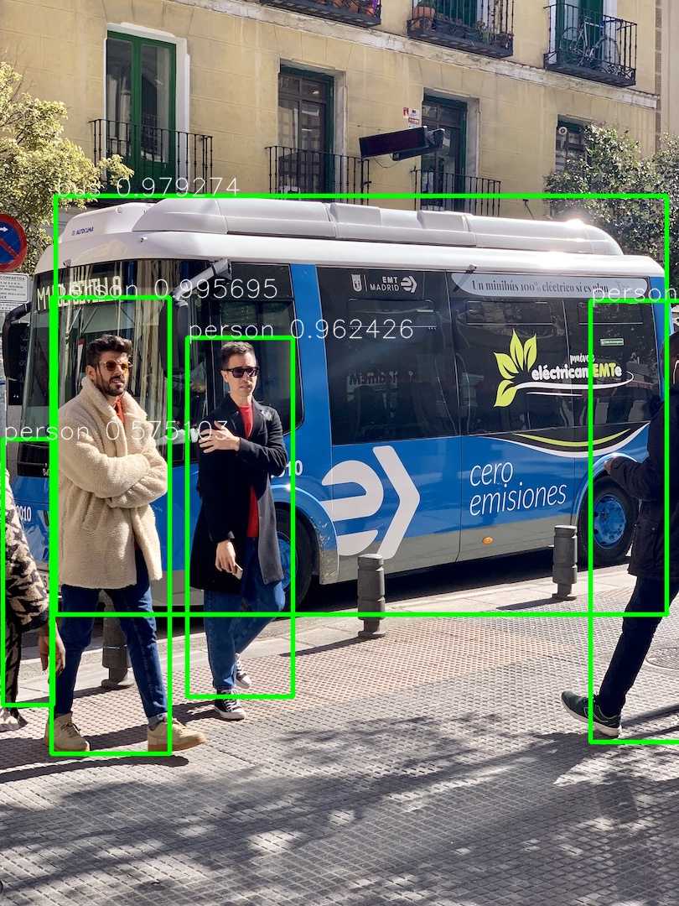

# opencv_aardio
**opencv_aardio**是使用aardio封装的OpenCV开源计算机视觉库.接口实现上尽量接近[opencv-python](https://pypi.org/project/opencv-python/)风格,以降低学习成本.本库适配最新OpenCV 4.5.3

### 依赖项目:

1. [aardio](http://www.aardio.com/)
2. [OpenCV](https://opencv.org)
4. [opencv-plugin](https://github.com/xuncv/opencv-plugin/) (修改自[OpenCVSharp](https://github.com/shimat/opencvsharp))

### 使用方法:

1. 下载项目源码
2. 前往 https://github.com/xuncv/opencv-plugin/releases
   下载最新dll文件,复制到`/lib/cv2/.res/`中

### OpenCV-aardio中文文档(编写中)

[opencv_aardio中文文档 (xuncv.github.io)](https://xuncv.github.io/#/)

### DEMO:

```
import cv2
img = cv2.imread("./images/Lena.jpg",1)
img = cv2.medianBlur(img,5)
cv2.imshow( "窗口标题",img )
cv2.imwrite("result.jpg",img)
cv2.waitKey(0)
```


##### YOLO



### DNN / AI 推理支持

当前 `cv2.dnn` 已封装 OpenCV DNN 的基础推理接口，并提供分类、检测、分割常用后处理工具：

```aardio
import cv2;

var net = cv2.readNetFromONNX("/models/model.onnx");
var img = cv2.imread("/images/test.jpg");
var blob = cv2.blobFromImage(img,1/255,[224,224],[0,0,0],true,false);

net.setInput(blob);
var out = net.forward();

var top5 = cv2.dnnDecodeClassification(out,["cat","dog","bird"],5,true);
```

已支持：

- `blobFromImage / blobFromImages`
- `readNet / readNetFromONNX / readNetFromCaffe / readNetFromDarknet / readNetFromTensorflow / readNetFromTorch`
- `Net.setInput / Net.forward / Net.forwardLayers`
- `Mat.toFloatArray / Mat.toDoubleArray`
- 分类后处理：`softmax / argmax / topK / dnnDecodeClassification`
- 检测后处理：`NMSBoxes / dnnDecodeYolo / dnnDecodeSSD / dnnDecodeFasterRCNN / dnnDrawDetections`
- 分割后处理：`dnnDecodeBinaryMask / dnnDecodeSegmentation`

详细说明见：[`docs/dnn.md`](./docs/dnn.md)

可运行示例：

```text
samples/dnn_minimal_caffe_relu.aardio
samples/dnn_minimal_onnx_relu.aardio
samples/dnn_postprocess_demo.aardio
samples/highgui_imshow.aardio
```

### 期望解决的问题：

1. 充分融合aardio的胶水特性，增强aardio图像处理能力。
2. 结合aardio桌面优势，如制作上位机软件时可提高工程进度。
3. 使opencv项目轻量化。（我的conda文件夹已经10+G了）。
4. 提高opencv启动速度，在算法测试中提高效率。
5. 实时窗体显示,便于调参。
